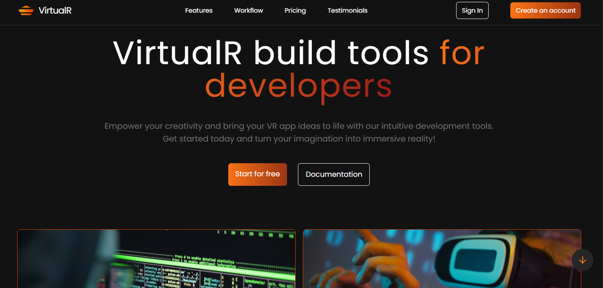

# VisualR 💻 

## ✏️ Descrição  
<b>VisualR</b> é uma landing page de um produto fictício de realidade virtual que auxilia o processo de desenvolvimento de aplicações. Desenvolvi o projeto para compreender e praticar a utilização do <b>tailwindcss</b> para estilizações com base na videoaula do canal <b>[compiletab](https://www.youtube.com/@compiletab)</b>, que explica de uma maneira clara todo o processo.  
Além disso, realizei alguns incrementos como a adição de <u>redirecionamento</u> e <u>rolagens fluidas</u> na página ao clicar nos tópicos da navbar, um <u>botão de ir para o final do site</u> e <u>hover</u> nos botões.

## 🌐 Acesse o projeto <u>[aqui](https://vr-landing-page-tailwind.vercel.app/):</u> 
  
## 🖼️ Prévia  
 

## 🛠️ Tecnologias Utilizadas  
- **React**  
- **JavaScript**  
- **Tailwindcss** 

## ⚠️ Importante

- Certifique-se de ter a versão 22.11.0 do node instalada em sua máquina

## 🚀 Como Executar o Projeto  

1. Clone o repositório e navegue até sua pasta:  
   ```bash  
   git clone https://github.com/AnaMotta223/vr-landing-page-tailwind.git 
   cd vr-landing-page-tailwind  
   ```  

2. Instale as dependências:  
   ```bash  
   npm install  
   ```  
4. Inicie o projeto:  
   ```bash  
   npm run dev 
   ```  
---